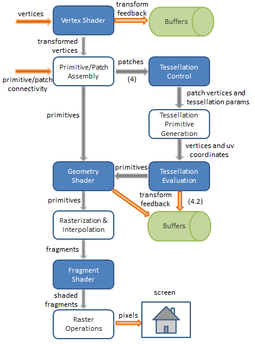
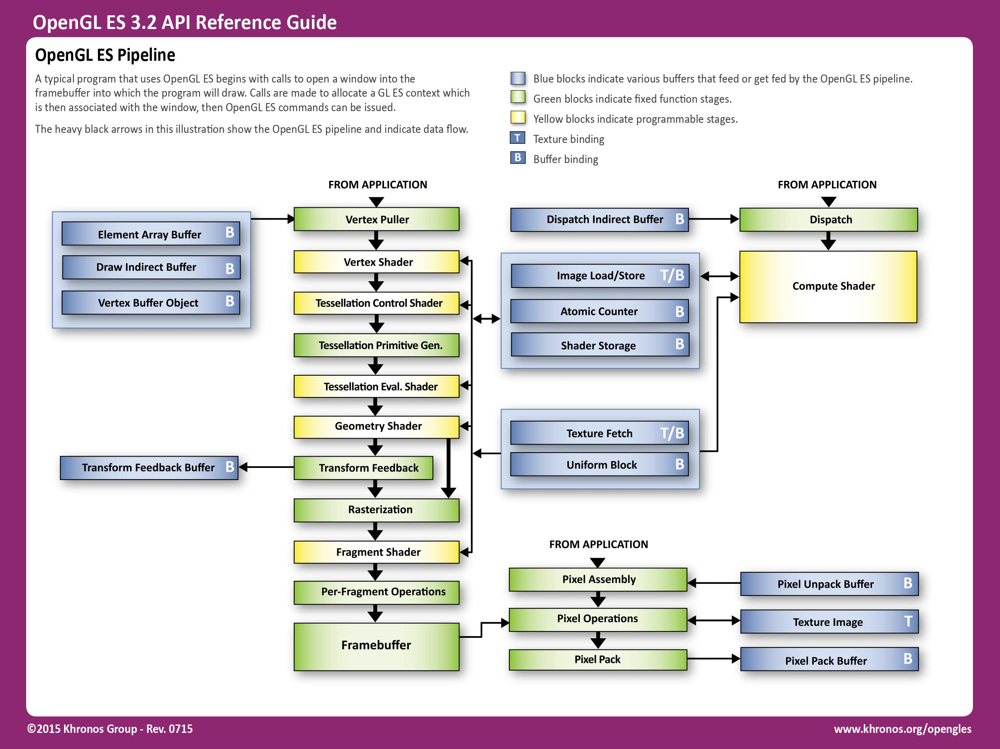
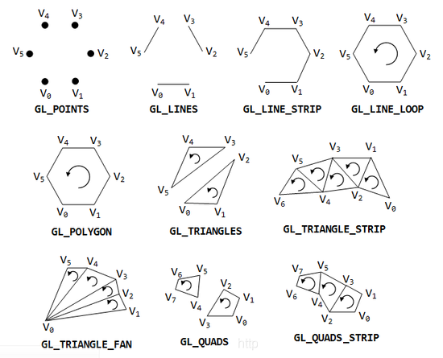
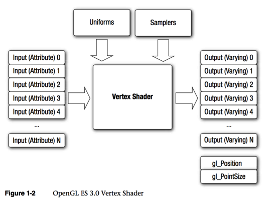
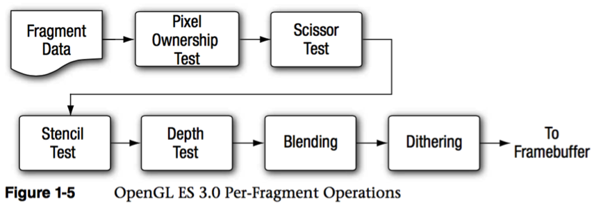

# Pipeline

## OpenGL ES 3.2 pipeline

!!! info "渲染管线各阶段的工作内容 图中的图元装配实际上是 <color_y>早期图元装配</color_y> "
    

> 

## OpenGL 基本图元

## Shader

none (Default) same as in
in For parameter passed into a function
out For values passed out of a function
inout Function parameters passed in and out

## 参考
[Rendering_Pipeline_Overview](https://www.khronos.org/opengl/wiki/Rendering_Pipeline_Overview)  
[OpenGL 4.5 Reference Guide](./assets/opengl45-quick-reference-card.pdf)  
[OpenGL ES 3.2 Reference Guide](./assets/opengles32-quick-reference-card.pdf)  