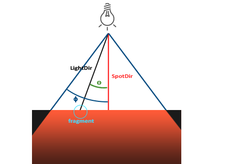

# 光源

[参考 https://learnopengl-cn.github.io/02%20Lighting/05%20Light%20casters/](https://learnopengl-cn.github.io/02%20Lighting/05%20Light%20casters/)

## 定向光源(Directional Light)

当一个光源处于很远的地方时，来自光源的每条光线就会近似于互相平行。不论物体和观察者在什么位置，看起来好像所有的光都来自于同一个方向。当我们使用一个假设光源处于无限远处的模型时，它就被称为定向光，因为所有的光线都是平行的，所以物体与光源的相对位置就不重要了。适用于模拟太阳光。

!!! back
    

我们可以定义一个方向向量而不是位置向量来模拟一个定向光

~~~ c
struct Light {
    // vec3 position; // 使用定向光就不再需要了
    vec3 direction;

    vec3 ambient;
    vec3 diffuse;
    vec3 specular;
};
...
void main()
{
  vec3 lightDir = normalize(-light.direction);
  ...
}
~~~

!!! warning "注意"
    我们目前使用的光照计算需要一个从片段至光源的光线方向，但人们更习惯定义定向光为一个从光源出发的全局方向。所以我们需要对全局光照方向向量取反来改变它的方向。

## 点光源(Point Light)

点光源是处于世界中某一个位置的光源，它会朝着所有方向发光，但光线会随着距离逐渐衰减。适用于模拟灯泡。

### 衰减

衰减(Attenuation)：随着光线传播距离的增长逐渐削减光的强度。

在现实世界中，灯泡在近处通常会非常亮，但随着距离的增加光源的亮度一开始会下降非常快，但在远处时剩余的光强度就会下降的非常缓慢了。

!!!info "衰减公式"
    $$
    F_{att} = \frac{1.0}{K_c + K_l * d + K_q * d^2}
    $$

    d：片段到光源的距离  
    \(K_c\)：常数项。通常为1.0，它的主要作用是保证分母永远大于1，否则在某些距离上它反而会增加强度。  
    \(K_l\)：一次项。与距离值相乘，保证光以线性的方式减少强度。  
    \(K_q\)：二次项。与距离的平方相乘，在距离比较小的时候影响会比一次项小很多，但当距离值比较大的时候它就会比一次项更大了。

!!! back
    下图可以看到光在近距离的时候有着最高的强度，但随着距离增长，它的强度明显减弱，并缓慢地在距离大约100的时候强度接近0

    

    

~~~ c
struct Light {
    vec3 position;  
  
    vec3 ambient;
    vec3 diffuse;
    vec3 specular;
	
    float constant;
    float linear;
    float quadratic;
};

//...省略部分代码

void main()
{
    // ambient
    vec3 ambient = light.ambient * texture(material.diffuse, TexCoords).rgb;
  	
    // diffuse 
    vec3 norm = normalize(Normal);
    vec3 lightDir = normalize(light.position - FragPos);
    float diff = max(dot(norm, lightDir), 0.0);
    vec3 diffuse = light.diffuse * diff * texture(material.diffuse, TexCoords).rgb;  
    
    // specular
    vec3 viewDir = normalize(viewPos - FragPos);
    vec3 reflectDir = reflect(-lightDir, norm);  
    float spec = pow(max(dot(viewDir, reflectDir), 0.0), material.shininess);
    vec3 specular = light.specular * spec * texture(material.specular, TexCoords).rgb;  
    
    // attenuation
    float distance    = length(light.position - FragPos);
    float attenuation = 1.0 / (light.constant + light.linear * distance + light.quadratic * (distance * distance));    

    ambient  *= attenuation;  
    diffuse   *= attenuation;
    specular *= attenuation;   
        
    vec3 result = ambient + diffuse + specular;
    FragColor = vec4(result, 1.0);
} 
~~~

#### 常用数值

[Ogre3D的Wiki](https://wiki.ogre3d.org/tiki-index.php?page=-Point+Light+Attenuation)

距离|常数项|一次项|二次项
-------|------|-----|------
7|1.0|0.7|1.8
13|1.0|0.35|0.44
20|1.0|0.22|0.20
32|1.0|0.14|0.07
50|1.0|0.09|0.032
65|1.0|0.07|0.017
100|1.0|0.045|0.0075
160|1.0|0.027|0.0028
200|1.0|0.022|0.0019
325|1.0|0.014|0.0007
600|1.0|0.007|0.0002
3250|1.0|0.0014|0.000007

## 聚光源(Spot Light)

聚光源是从锥形空间中的一个单独的点处发出光照的光源。适用于模拟手电筒。

OpenGL中聚光是用一个世界空间位置、一个方向和一个切光角(Cutoff Angle)来表示的，切光角指定了聚光的半径（圆锥的半径）。

!!! back
    

    - `LightDir`：从片段指向光源的向量。
    - `SpotDir`：聚光所指向的方向。
    - `Phi`\(\phi\)：指定了聚光半径的切光角。落在这个角度之外的物体都不会被这个聚光所照亮。
    - `Theta`\(\theta\)：向量 \(\bar{LightDir}\)和\(\bar{SpotDir}\) 之间的夹角。在聚光源内部的话\(\theta\)值应该比\(\phi\)值小。

所以我们要做的就是计算向量 \(\bar{LightDir}\)和\(\bar{SpotDir}\) 的点积，并将它与切光角 \(\phi\) 对比。

### 平滑/软化边缘

为了创建一种看起来边缘平滑的聚光，我们需要模拟聚光源有一个内圆锥(Inner Cone)和一个外圆锥(Outer Cone),让光从内圆锥逐渐减暗，直到外圆锥的边界。

-   如果片段在 内圆锥之内，它的强度是 1.0
-   如果片段在 外圆锥之外，它的强度是 0.0
-   如果片段在 内外圆锥之间，它的强度是 0.0 ~ 1.0

!!! info "强度公式"
    $$
        I = \frac{cos\theta - cos\gamma}{cos\phi - cos\gamma}
    $$

    \(\theta\)：向量 \(\bar{LightDir}\)和\(\bar{SpotDir}\) 之间的夹角  
    \(\phi\)：聚光半径的**内切光角**  
    \(\gamma\)：聚光半径的**外切光角**  
    \(I\)：在当前片段聚光的强度  

~~~ c 
struct Light {
    vec3 position;  
    vec3 direction;
    float cutOff;
    float outerCutOff;
  
    vec3 ambient;
    vec3 diffuse;
    vec3 specular;
	
    float constant;
    float linear;
    float quadratic;
};

//... 省略部分代码

void main()
{
    // ambient
    vec3 ambient = light.ambient * texture(material.diffuse, TexCoords).rgb;
    
    // diffuse 
    vec3 norm = normalize(Normal);
    vec3 lightDir = normalize(light.position - FragPos);
    float diff = max(dot(norm, lightDir), 0.0);
    vec3 diffuse = light.diffuse * diff * texture(material.diffuse, TexCoords).rgb;  
    
    // specular
    vec3 viewDir = normalize(viewPos - FragPos);
    vec3 reflectDir = reflect(-lightDir, norm);  
    float spec = pow(max(dot(viewDir, reflectDir), 0.0), material.shininess);
    vec3 specular = light.specular * spec * texture(material.specular, TexCoords).rgb;  
    
    // spotlight (soft edges)
    float theta = dot(lightDir, normalize(-light.direction)); 
    float epsilon = (light.cutOff - light.outerCutOff);
    float intensity = clamp((theta - light.outerCutOff) / epsilon, 0.0, 1.0);
    diffuse  *= intensity;
    specular *= intensity;
    
    // attenuation
    float distance    = length(light.position - FragPos);
    float attenuation = 1.0 / (light.constant + light.linear * distance + light.quadratic * (distance * distance));    
    ambient  *= attenuation; 
    diffuse   *= attenuation;
    specular *= attenuation;   
        
    vec3 result = ambient + diffuse + specular;
    FragColor = vec4(result, 1.0);
} 
} 
~~~

