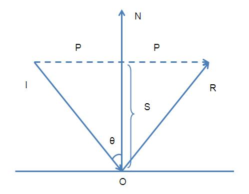

# 光照

[参考 https://learnopengl-cn.github.io/02%20Lighting/02%20Basic%20Lighting/](https://learnopengl-cn.github.io/02%20Lighting/02%20Basic%20Lighting/)

现实世界的光照是极其复杂的，而且会受到诸多因素的影响，这是我们有限的计算能力所无法模拟的。因此OpenGL的光照使用的是简化的模型，对现实的情况进行近似，这样处理起来会更容易一些，而且看起来也差不多一样。

这些光照模型都是基于我们对光的物理特性的理解。其中一个模型被称为冯氏光照模型(Phong Lighting Model)。

冯氏光照模型的主要结构由3个分量组成：环境(Ambient)、漫反射(Diffuse)和镜面(Specular)光照

- 环境光照(Ambient Lighting)：即使在黑暗的情况下，世界上通常也仍然有一些光亮（月亮、远处的光），所以物体几乎永远不会是完全黑暗的。为了模拟这个，我们会使用一个环境光照常量，它永远会给物体一些颜色。
- 漫反射光照(Diffuse Lighting)：模拟光源对物体的方向性影响(Directional Impact)。它是冯氏光照模型中视觉上最显著的分量。物体的某一部分越是正对着光源，它就会越亮。
- 镜面光照(Specular Lighting)：模拟有光泽物体上面出现的亮点。镜面光照的颜色相比于物体的颜色会更倾向于光的颜色。

## 环境光照(Ambient Lighting)

~~~ c
    void main()
    {
        float ambientStrength = 0.1;    //环境因子
        vec3 ambient = ambientStrength * lightColor;

        vec3 result = ambient * objectColor;
        FragColor = vec4(result, 1.0);
    }
~~~

## 漫反射光照(Diffuse Lighting)

漫反射光照使物体上与光线方向越接近的片段(光线和片段的角度越小)越能从光源处获得更多的亮度，如果光线垂直于物体表面，这束光对物体的影响会最大化（即达到最亮）。为了能够更好的理解漫反射光照，请看下图：

!!! back
    

### 法向量(Normal Vector)

为了测量光线和片段的角度，我们使用法向量(Normal Vector)，它是一个垂直于顶点表面的（单位）向量（上图中以黄色箭头表示），这两个向量之间的角度很容易就能够通过点乘计算出来。可以使用法线贴图来存储顶点的法线。

!!! important
    l: 光照向量  
    n: 法线向量  

    ~~~math
	    \cos \theta = \frac{\bar{L} \cdot \bar{N}}{||\bar{L}|| \cdot ||\bar{N}||}
    ~~~

~~~ c
    //两个向量之间的角度大于90度时，点乘结果为负数，导致漫反射分量为负数。负数颜色的光照没有意义。
    float diff = max(dot(norm, lightDir), 0.0);
    vec3 diffuse = diff * lightColor;
    vec3 result = (ambient + diffuse) * objectColor;
    FragColor = vec4(result, 1.0);
~~~

### 法线矩阵(Normal Matrix)

当应用一个不等比缩放时，法向量就不会再垂直于对应的表面，这样光照就会被破坏。修复这个行为的诀窍是使用一个为法向量专门定制的模型矩阵。这个矩阵称之为[法线矩阵(Normal Matrix)](http://www.lighthouse3d.com/tutorials/glsl-tutorial/the-normal-matrix/)。它使用了一些线性代数的操作来移除对法向量错误缩放的影响。

法线矩阵被定义为「模型矩阵的逆矩阵的转置矩阵」

!!! back
    

!!! attention
    即使是对于着色器来说，逆矩阵也是一个开销比较大的运算，因此，应该避免在着色器中进行逆矩阵运算，在绘制之前最好用CPU计算出法线矩阵，然后通过uniform把值传递给着色器。

## 镜面光照(Specular Lighting)

和漫反射光照一样，镜面光照也是光的方向向量和物体的法向量来决定的。镜面光照是基于光的反射特性（反射角等于入射角）。

但是它也依赖于观察方向，反射向量和视线方向的夹角越小，镜面光的影响就会越大（形成高光）。

!!! back
    

~~~ c
    float specularStrength = 0.5;
    vec3 viewDir = normalize(viewPos - FragPos);
    vec3 reflectDir = reflect(-lightDir, norm);
    //32次幂。这个32是高光的反光度(Shininess)。
    //一个物体的反光度越高，反射光的能力越强，散射得越少，高光点就会越小。
    float spec = pow(max(dot(viewDir, reflectDir), 0.0), 32);
    vec3 specular = specularStrength * spec * lightColor;
    vec3 result = (ambient + diffuse + specular) * objectColor;
    FragColor = vec4(result, 1.0);
~~~

!!! note "不同 反光度 的视觉效果影响"
    

## Demo
~~~ c
    //fragment shader
    #version 330 core
    out vec4 FragColor;

    in vec3 Normal;  
    in vec3 FragPos;  
    
    uniform vec3 lightPos; 
    uniform vec3 viewPos; 
    uniform vec3 lightColor;
    uniform vec3 objectColor;

    void main()
    {
        // ambient
        float ambientStrength = 0.1;
        vec3 ambient = ambientStrength * lightColor;
        
        // diffuse 
        vec3 norm = normalize(Normal);
        vec3 lightDir = normalize(lightPos - FragPos);
        float diff = max(dot(norm, lightDir), 0.0);
        vec3 diffuse = diff * lightColor;
        
        // specular
        float specularStrength = 0.5;
        vec3 viewDir = normalize(viewPos - FragPos);
        vec3 reflectDir = reflect(-lightDir, norm);  
        float spec = pow(max(dot(viewDir, reflectDir), 0.0), 32);
        vec3 specular = specularStrength * spec * lightColor;  
            
        vec3 result = (ambient + diffuse + specular) * objectColor;
        FragColor = vec4(result, 1.0);
    } 
~~~