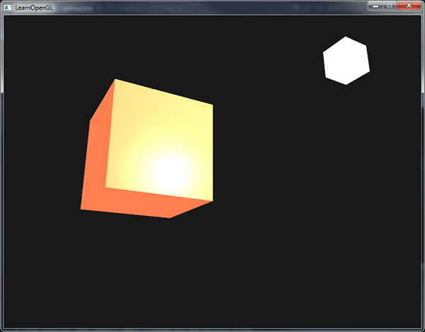

# 材质

[参考 https://learnopengl-cn.github.io/02%20Lighting/03%20Materials/](https://learnopengl-cn.github.io/02%20Lighting/03%20Materials/)

根据 [上节光照](./光照.md) 的内容，可以用这三个分量来定义一个材质颜色(Material Color)：

    - 环境光照(Ambient Lighting)
    - 漫反射光照(Diffuse Lighting)
    - 镜面光照(Specular Lighting)

通过为每个分量指定一个颜色，我们就能够精确控制物体的颜色了。

现在，我们再添加反光度(Shininess)这个分量到上述的三个颜色中，这样就有了我们需要的所有的材质属性了：

~~~ c
    #version 330 core
    struct Material {
        vec3 ambient;
        vec3 diffuse;
        vec3 specular;
        float shininess;
    }; 

    uniform Material material;
~~~

## 常用材质属性

| Name | Ambient | Diffuse | Specular | Shininess |
|  ----  | ----  | ----  | ----  | ----  |
| emerald(祖母绿) | (0.0215, 0.1745, 0.0215) | (0.07568, 0.61424, 0.07568) | (0.633, 0.727811, 0.633) | 0.6 |
| jade(翡翠绿) | (0.135, 0.2225, 0.1575) | (0.54, 0.89, 0.63) | (0.316228, 0.316228, 0.316228) | 0.1 |
| obsidian(黑曜石) | (0.05375, 0.05, 0.06625) | (0.18275, 0.17, 0.22525) | (0.332741, 0.328634, 0.346435) | 0.3 |
| pearl(珍珠白) | (0.25, 0.20725, 0.20725) | (1, 0.829, 0.829) | (0.296648, 0.296648, 0.296648) | 0.088 |
| ruby(红宝石) | (0.1745, 0.01175, 0.01175) | (0.61424, 0.04136, 0.04136) | (0.727811, 0.626959, 0.626959) | 0.6 |
| turquoise(青绿色) | (0.1, 0.18725, 0.1745) | (0.396, 0.74151, 0.69102) | (0.297254, 0.30829, 0.306678) | 0.1 |
| brass(黄铜) | (0.329412, 0.223529, 0.027451) | (0.780392, 0.568627, 0.113725) | (0.992157, 0.941176, 0.807843) | 0.21794872 |
| bronze(青铜) | (0.2125, 0.1275, 0.054) | (0.714, 0.4284, 0.18144) | (0.393548, 0.271906, 0.166721) | 0.2 |
| chrome(铬合金) | (0.25, 0.25, 0.25) | (0.4, 0.4, 0.4) | (0.774597, 0.774597, 0.774597) | 0.6 |
| copper(紫铜色) | (0.19125, 0.0735, 0.0225) | (0.7038, 0.27048, 0.0828) | (0.256777, 0.137622, 0.086014) | 0.1 |
| gold(金色) | (0.24725, 0.1995, 0.0745) | (0.75164, 0.60648, 0.22648) | (0.628281, 0.555802, 0.366065) | 0.4 |
| silver(银色) | (0.19225, 0.19225, 0.19225) | (0.50754, 0.50754, 0.50754) | (0.508273, 0.508273, 0.508273) | 0.4 |
| black plastic(黑塑料) | (0.0, 0.0, 0.0) | (0.01, 0.01, 0.01) | (0.50, 0.50, 0.50) | 0.25 |
| cyan plastic(青塑料) | (0.0, 0.1, 0.06) | (0.0, 0.50980392, 0.50980392) | (0.50196078, 0.50196078, 0.50196078) | 0.25 |
| green plastic(绿塑料) | (0.0, 0.0, 0.0) | (0.1, 0.35, 0.1) | (0.45, 0.55, 0.45) | 0.25 |
| red plastic(红塑料) | (0.0, 0.0, 0.0) | (0.5, 0.0, 0.0) | (0.7, 0.6, 0.6) | 0.25 |
| white plastic(白塑料) | (0.0, 0.0, 0.0) | (0.55, 0.55, 0.55) | (0.70, 0.70, 0.70) | 0.25 |
| yellow plastic(黄塑料) | (0.0, 0.0, 0.0) | (0.5, 0.5, 0.0) | (0.60, 0.60, 0.50) | 0.25 |
| black rubber(黑橡胶) | (0.02, 0.02, 0.02) | (0.01, 0.01, 0.01) | (0.4, 0.4, 0.4) | 0.078125 |
| cyan rubber(青橡胶) | (0.0, 0.05, 0.05) | (0.4, 0.5, 0.5) | (0.04, 0.7, 0.7) | 0.078125 |
| green rubber(绿橡胶) | (0.0, 0.05, 0.0) | (0.4, 0.5, 0.4) | (0.04, 0.7, 0.04) | 0.078125 |
| red rubber(红橡胶) | (0.05, 0.0, 0.0) | (0.5, 0.4, 0.4) | (0.7, 0.04, 0.04) | 0.078125 |
| white rubber(白橡胶) | (0.05, 0.05, 0.05) | (0.5, 0.5, 0.5) | (0.7, 0.7, 0.7) | 0.078125 |
| yellow rubber(黄橡胶) | (0.05, 0.05, 0.0) | (0.5, 0.5, 0.4) | (0.7, 0.7, 0.04) | 0.078125 |

## 设置材质

~~~ c
    void main()
    {    
        // 环境光
        vec3 ambient = lightColor * material.ambient;

        // 漫反射 
        vec3 norm = normalize(Normal);
        vec3 lightDir = normalize(lightPos - FragPos);
        float diff = max(dot(norm, lightDir), 0.0);
        vec3 diffuse = lightColor * (diff * material.diffuse);

        // 镜面光
        vec3 viewDir = normalize(viewPos - FragPos);
        vec3 reflectDir = reflect(-lightDir, norm);  
        float spec = pow(max(dot(viewDir, reflectDir), 0.0), material.shininess);
        vec3 specular = lightColor * (spec * material.specular);  

        vec3 result = ambient + diffuse + specular;
        FragColor = vec4(result, 1.0);
    }
~~~

~~~ c
lightingShader.setVec3("material.ambient",  1.0f, 0.5f, 0.31f);
lightingShader.setVec3("material.diffuse",  1.0f, 0.5f, 0.31f);
lightingShader.setVec3("material.specular", 0.5f, 0.5f, 0.5f);
lightingShader.setFloat("material.shininess", 32.0f);
~~~

## 光的属性

光源对环境光、漫反射和镜面光分量应该具有着不同的强度，否则就会像上图一样 物体过于明亮。

可以创建一些光照属性来影响每个单独的光照分量

~~~ c
struct Light {
    vec3 position;

    vec3 ambient;
    vec3 diffuse;
    vec3 specular;
};

uniform Light light;
~~~

~~~ c
vec3 ambient  = light.ambient * material.ambient;
vec3 diffuse  = light.diffuse * (diff * material.diffuse);
vec3 specular = light.specular * (spec * material.specular);
~~~

~~~ c
lightingShader.setVec3("light.ambient",  0.2f, 0.2f, 0.2f);
lightingShader.setVec3("light.diffuse",  0.5f, 0.5f, 0.5f); // 将光照调暗了一些以搭配场景
lightingShader.setVec3("light.specular", 1.0f, 1.0f, 1.0f); 
~~~

## 材质贴图

我们还可以通过材质贴图更精确的控制对物体的每个片段设置反射颜色。

因为环境光颜色在几乎所有情况下都等于漫反射颜色，所以不需要将它们分开储存

~~~ c
struct Material {
    sampler2D diffuse;
    sampler2D specular;
    float     shininess;
};
~~~

~~~ c
vec3 ambient  = light.ambient  * vec3(texture(material.diffuse, TexCoords));
vec3 diffuse  = light.diffuse  * diff * vec3(texture(material.diffuse, TexCoords));  
vec3 specular = light.specular * spec * vec3(texture(material.specular, TexCoords));
FragColor = vec4(ambient + diffuse + specular, 1.0);
~~~
