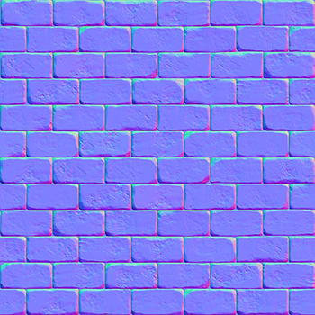

# 法线贴图

当光照射到物体表面时，我们是通过表面的法线向量来计算光照的。现实中的物体表面并非是平坦的，而是表现出无数（凹凸不平的）细节。如何表现出这些细节呢？让每个 Fragment 使用自己的法线，就可以让光照相信一个表面是由很多微小的（垂直于法线向量的）平面所组成的，物体表面的细节将会得到极大提升。这种每个fragment使用各自的法线，替代一个面上所有fragment使用同一个法线的技术叫做法线贴图（normal mapping）或凹凸贴图（bump mapping）。

!!! back
    

为使法线贴图工作，需要为每个fragment提供一个法线。像diffuse贴图和specular贴图一样，我们可以使用一个2D纹理来储存法线数据。2D纹理不仅可以储存颜色和光照数据，还可以储存法线向量。这样就可以从2D纹理中采样得到特定纹理的法线向量。

!!! info "法线贴图"
    将法线向量的x、y、z元素储存到纹理中，代替颜色的r、g、b元素。
    法线向量的范围在-1到1之间，先要将其映射到0到1的范围：

        vec3 rgb_normal = normal * 0.5 + 0.5; // 从 [-1,1] 转换至 [0,1]

将法线向量变换为RGB颜色元素，就能把根据表面的形状的fragment的法线保存在2D纹理中。如：

!!! info "注意"
    法线贴图是一种偏蓝色调的纹理。这是因为所有法线的指向都偏向z轴（0, 0, 1）这是一种偏蓝的颜色。法线向量从z轴方向也向其他方向轻微偏移，颜色也就发生了轻微变化，这样看起来便有了一种深度。例如，上图中可以看到在每个砖块的顶部，颜色倾向于偏绿，这是因为砖块的顶部的法线偏向于指向正y轴方向（0, 1, 0），这样它就是绿色的了。

~~~ c
uniform sampler2D normalMap;  

void main()
{           
    // 从法线贴图范围[0,1]获取法线
    normal = texture(normalMap, fs_in.TexCoords).rgb;
    // 将法线向量转换为范围[-1,1]
    normal = normalize(normal * 2.0 - 1.0);   

    [...]
    // 像往常那样处理光照
}
~~~

# 切线空间（tangent space）

法线贴图中的所有法线向量都是指向正z方向的。当物体表面的法线指向正y方向时怎么办呢？

!!! info "切线空间"
    在一个不同的坐标空间中进行光照，这个坐标空间里，法线贴图向量总是指向这个坐标空间的正z方向；所有的光照向量都相对与这个正z方向进行变换。这样就能使用同样的法线贴图，不管朝向问题。这个坐标空间叫做切线空间（tangent space）。

!!! help "法线贴图"
    法线贴图中的法线向量定义在切线空间中，在切线空间中，法线永远指着正z方向。它就像法线贴图向量的本地空间。使用一个特定的矩阵我们就能将切线空间中的法线向量转成世界或视图空间下，使它们转向到最终的贴图表面的方向。

!!! help "TBN矩阵"
    TBN矩阵这三个字母分别代表 切线(Tagent)、副切线(Bitangent)和法线(Normal) 向量。要建构这样一个把切线空间转变为不同空间的变异矩阵，需要三个相互垂直的向量，它们沿一个表面的法线贴图对齐于：上、右、前

      
    
    [TBN矩阵的计算参考](https://learnopengl-cn.github.io/05%20Advanced%20Lighting/04%20Normal%20Mapping/#_3)