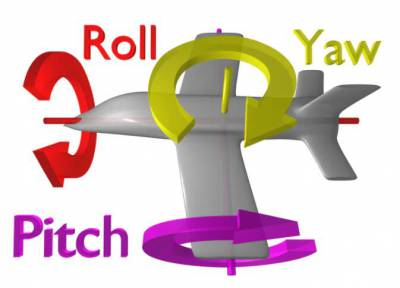

# Pitch，Yaw，Roll
----------------------

Pitch，Yaw，Roll是来自航空界的叫法

  -  Pitch : 俯仰角
      - 对应 UE4 中，绕 Y 轴旋转
  - Yaw : 偏航角
      - 对应 UE4 中，绕 Z 轴旋转
  - Roll : 翻滚角
      - 对应 UE4 中，绕 X 轴旋转





```c++
struct FRotator
{
public:
	/** Rotation around the right axis (around Y axis), Looking up and down (0=Straight Ahead, +Up, -Down) */
	float Pitch; 

	/** Rotation around the up axis (around Z axis), Running in circles 0=East, +North, -South. */
	float Yaw; 

	/** Rotation around the forward axis (around X axis), Tilting your head, 0=Straight, +Clockwise, -CCW. */
	float Roll;


	/**
	 * Constructor.
	 *
	 * @param InPitch Pitch in degrees.
	 * @param InYaw Yaw in degrees.
	 * @param InRoll Roll in degrees.
	 */
	FORCEINLINE FRotator( float InPitch, float InYaw, float InRoll );
}
```