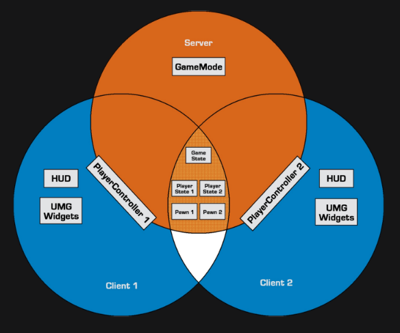
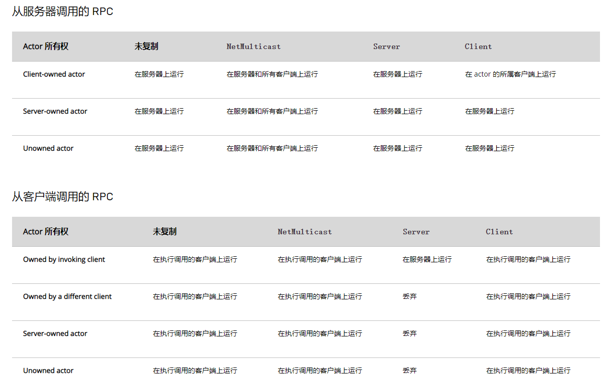

# 网络概要
----------------------


## Server-Client架构
| ServerOnly | Server&Clients | Server&OwningClient | OwningClientOnly |
| :-----| :---- | :---- | :---- |
| AGameMode | AGameState & APlayerState & APawn | APlayerController| AHUD & UMG |





## Replication


!!! tip "Replicated、ReplicatedUsing=FUNCTIONAME"
    属性随网络进行复制
    `ReplicatedUsing` 说明符指定一个回调函数(必须为`UFUNCTION`)，其在属性通过网络更新时执行

!!! tip "GetLifetimeReplicatedProps"
    需重写函数 `GetLifetimeReplicatedProps`
    并使用`DOREPLIFETIME`、`DOREPLIFETIME_CONDITION`等 注册需要同步的属性
    
    ```c++
    void ARORCharacter::GetLifetimeReplicatedProps(TArray< FLifetimeProperty >& OutLifetimeProps) const
    {
        Super::GetLifetimeReplicatedProps(OutLifetimeProps);

        DOREPLIFETIME(ARORCharacter, IsInCombat);
        DOREPLIFETIME_CONDITION(ARORCharacter, RowName, COND_InitialOnly);
        DOREPLIFETIME_CONDITION_NOTIFY(ARORCharacter, OnDieInfo, COND_None, REPNOTIFY_Always);
    }
    ```

    ```c++
    enum ELifetimeCondition
    {
        COND_None = 0							UMETA(DisplayName = "None"),							// This property has no condition, and will send anytime it changes
        COND_InitialOnly = 1					UMETA(DisplayName = "Initial Only"),					// This property will only attempt to send on the initial bunch
        COND_OwnerOnly = 2						UMETA(DisplayName = "Owner Only"),						// This property will only send to the actor's owner
        COND_SkipOwner = 3						UMETA(DisplayName = "Skip Owner"),						// This property send to every connection EXCEPT the owner
        COND_SimulatedOnly = 4					UMETA(DisplayName = "Simulated Only"),					// This property will only send to simulated actors
        COND_AutonomousOnly = 5					UMETA(DisplayName = "Autonomous Only"),					// This property will only send to autonomous actors
        COND_SimulatedOrPhysics = 6				UMETA(DisplayName = "Simulated Or Physics"),			// This property will send to simulated OR bRepPhysics actors
        COND_InitialOrOwner = 7					UMETA(DisplayName = "Initial Or Owner"),				// This property will send on the initial packet, or to the actors owner
        COND_Custom = 8							UMETA(DisplayName = "Custom"),							// This property has no particular condition, but wants the ability to toggle on/off via SetCustomIsActiveOverride
        COND_ReplayOrOwner = 9					UMETA(DisplayName = "Replay Or Owner"),					// This property will only send to the replay connection, or to the actors owner
        COND_ReplayOnly = 10					UMETA(DisplayName = "Replay Only"),						// This property will only send to the replay connection
        COND_SimulatedOnlyNoReplay = 11			UMETA(DisplayName = "Simulated Only No Replay"),		// This property will send to actors only, but not to replay connections
        COND_SimulatedOrPhysicsNoReplay = 12	UMETA(DisplayName = "Simulated Or Physics No Replay"),	// This property will send to simulated Or bRepPhysics actors, but not to replay connections
        COND_SkipReplay = 13					UMETA(DisplayName = "Skip Replay"),						// This property will not send to the replay connection
        COND_Never = 15							UMETA(Hidden),											// This property will never be replicated
        COND_Max = 16							UMETA(Hidden)
    };
    ```

## RPC

!!! tip "Server、Client、NetMulticast"
    声明 `RPC` 函数时，会声明一个名为 `函数名_Implementation` 的附加函数，而这个附加函数才是我们需要实现的 远程函数


!!! tip "Reliable、Unreliable"
    由于带宽或网络错误会导致 `RPC` 失败，当声明为 `Reliable` 时，会确保 `RPC` 成功
    非必要不要使用 `Reliable`


!!! tip "WithValidation"
    声明 `RPC` 函数时，会声明一个名为 `函数名_Validate` 的附加函数，此函数使用相同的参数，但是会返回`bool值`，只有返回 `true` 时才会成功调用 `RPC`





## Actor的所有权

!!! tip "Actor的所有权"
    每个`Connection`都有一个`PlayerController`，要确定某个Actor的所有权是否为该连接，查看其最外围的`Owner`是否为该连接持有的`PlayerController`即可

!!! tip "以下情形需要确定所有权"
    - `RPC`需要确定哪个客户端将执行`Run-On-Client RPC`
    - `Actor`复制与连接相关性
        - `bOnlyRelevantToOwner=true`的`Actor`，只有同步到拥有此`Actor`的连接
    - 在涉及所有者时的 `Actor` 属性复制条件
        - `DOREPLIFETIME_CONDITION` 中的 `COND_OwnerOnly` 等


## Actor相关性

某一时刻客户端（即该客户端拥有的连接）不一定需要看到服务器上所有的`Actor`， 虚幻引擎的网络代码中包含一处重要的带宽优化：服务器只会让客户端知道与其相关的 `Actor`。虚幻引擎（依次）参照以下规则确定`Actor`与客户端的相关性

!!! tip "AActor::IsNetRelevantFor()  相关性判断"
    1. 如果 `Actor` 是 `bAlwaysRelevant`、归属于 `Pawn` 或 `PlayerController`、本身为 `Pawn` 或者 `Pawn` 是某些行为（如噪音或伤害）的发起者，则其具有相关性。
    2. 如果 `Actor` 是 `bNetUseOwnerRelevancy` 且拥有一个所有者，则使用所有者的相关性。
    3. 如果 `Actor` 是 `bOnlyRelevantToOwner` 且没有通过第一轮检查，则不具有相关性。
    4. 如果 `Actor` 被附加到另一个 `Actor` 的骨架模型，它的相关性将取决于其所在基础的相关性。
    5. 如果 `Actor` 是不可见的 `(bHidden == true)` 并且它的 `Root Component` 并没有碰撞，那么则不具有相关性，
        - 如果没有 `Root Component`，`AActor::IsNetRelevantFor()` 会记录一条警告，提示是否要将它设置为 `bAlwaysRelevant=true`。
    6. 如果 `AGameNetworkManager` 被设置为使用基于距离的相关性，则只要 `Actor` 低于净剔除距离，即被视为具有相关性。

!!! tip "Pawn 和 PlayerController的相关性判断"
    `Pawn` 和 `PlayerController` 将覆盖 `AActor::IsNetRelevantFor()` 并最终具有不同的相关性条件


## 优先级设定

!!! tip "Actor 的 NetPriority"
    `Actor`有一个变量 `float NetPriority`。该变量的数值越大，该`Actor`的相对带宽就越多。

    和`NetPriority=1.0` 的`Actor`相比，`NetPriority=2.0` 的`Actor`可以得到两倍的更新频度。
    
    唯一影响优先顺序的就是它们的比值，无法通过提高所有优先级的数值来增加虚幻引擎的网络性能。

!!! tip "virtual void AActor::GetNetPriority() override;"
    计算`Actor`的当前优先级时使用了虚函数 `AActor::GetNetPriority()`。为避免出现饥荒（starvation），`AActor::GetNetPriority()` 使用`Actor`上次复制后经过的时间乘以`NetPriority`。该函数还考虑了`Actor` 与观察者的相对位置以及两者之间的距离。