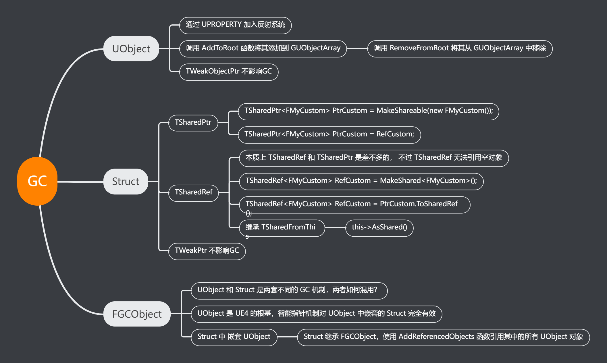

# UE4的垃圾回收系统
----------------------
  
!!! info "追踪式GC"
	1. 标记阶段：从根结点集合开始递归的标记所有可达对象。
	2. 清扫阶段：遍历所有对象，将没有标记为可达的对象回收，并清理标记位。

!!! tip "注意"
	- UObject类型的变量，即使是static，默认也会被GC掉。
	- 防止UObject对象被GC掉，就要保持对其引用




### 1、UPROPERTY

```c++
	UPROPERTY()
	class UPaperTileMap* AssetToRename;

	UPROPERTY()
	TMap<UCompositingElementInput*, ECompPassConstructionType>
	UserConstructedInputs;
```


### 2、AddToRoot

```c++
	m_sInstance = NewObject<T>();
	m_sInstance->AddToRoot();
```

!!! tip "注意"
	释放的时候需要调用 m_sInstance->RemoveFromRoot();


### 3、TWeakObjectPtr

!!! tip "注意"
	弱引用，不影响变量的 GC


### 4、TSharedPtr

!!! info "共享指针"
	- 共享指针，类似C++标准库的共享智能指针，用于自定义的结构体。
	- TSharedPtr<FTest> Test = MakeShareable(new FTest());
	- 不能用于UObject对象(TWeakPtr倒是可以用于UObject), 因为UObject有一套专用的GC规则。

```c++
class MYPROJECT2_API FTest
{
public:
	FTest();
	~FTest();
};

#include "FTest.h"

FTest::FTest()
{
	UE_LOG(LogTemp, Warning, TEXT("1111FTest Constrction"));
}
 
FTest::~FTest()
{
	UE_LOG(LogTemp, Warning, TEXT("2222FTest Deconstrction"));
}

UCLASS()
class MYPROJECT2_API ATestActor : public AActor
{
    GENERATED_BODY()
    
public:    
    // Sets default values for this actor's properties
    ATestActor();
 
 
    TSharedPtr<FTest> Test;
protected:
    // Called when the game starts or when spawned
    virtual void BeginPlay() override;
 
}
 
// Called when the game starts or when spawned
void ATestActor::BeginPlay()
{
    Super::BeginPlay();
 
    Test = MakeShareable(new FTest());
    
}
```

### 5、FGCObject


!!! help "如何混用"
	- 已知 UObject 类通过 NewObject 创建并自动 GC
	- 非 UObject 类通过 MakeShareable 来创建 TSharedPtr 来自动 GC
	- 而 非 UObject 类中出现 UObject 变量怎么办呢？

!!! info "FGCObject"
	UE4 提供了 FGCObject，非 UObject 类可以继承 FGCObject，然后通过 AddReferencedObjects 函数对 UObject 对象添加引用。


``` c++
#include "GCObject.h"
 
class UCameraAnim;
/**
 * 
 */
class MYPROJECT2_API FTest :public FGCObject
{
public:
	FTest();
	~FTest();
 
	UCameraAnim* CameraAnim;
 
protected:
	virtual void AddReferencedObjects(FReferenceCollector& Collector) override
	{
		Collector.AddReferencedObject(CameraAnim);
	}
};
```


### 6、TSharedRef

!!! info "共享引用"
	本质上共享引用(TSharedRef)和共享指针(TSharedPtr)是差不多的，一样是用于非UObject体系的对象，不过 TSharedRef 和 TSharedPtr 的不同在于共享引用无法引用空对象，编译直接报错。TSharedRef连 “IsValid” 判断是否非空都没有，强逼你使用必定是有效的引用。所以在 UE4 的 SWidget 中大量使用 TSharedRef<SWidget>。

```c++
//正确的声明定义
TSharedRef<FMyCustom> MyCustom = MakeShared<FMyCustom>();

//错误的声明定义
//TSharedRef没有空引用，应该持有的对象必须是有效的
//TSharedRef<FMyCustom> MyCustom;
//TSharedRef<FMyCustom> MyCustom = nullptr;

//TSharedPtr转为TSharedRef
TSharedPtr<FMyCustom> MySharedPtr = MakeShareable(new FMyCustom);
TSharedRef<FMyCustom> MySharedRef = MySharedPtr.ToSharedRef();
```

```c++
// TSharedRef可以转化为TSharedPtr， 直接等于就可以了
TSharedRef<FMyCustom> RefCustom = MakeShared<FMyCustom>();
TSharedPtr<FMyCustom> PtrCustom = RefCustom;
```


#### TSharedFromThis
!!! info "TSharedFromThis"
	一个普通的结构体继承 TSharedFromThis，就可以拥有 AsShared 函数让普通的结构体对象转为 TSharedRef, 像 SWidget 这个类本身就使用了 TSharedFromThis。

```c++
FMyCustom MyCustom;
TSharedRef<FMyCustom> FMyCustomRef = MyCustom.AsShared();
```

### 7、TWeakPtr

!!! info "TWeakPtr"
	- 上面说到了 TWeakObjectPtr，专门用于UObject, 相应的普通结构体也有弱指针 TWeakPtr, 能够访问一个非UObject对象，但又不影响 GC。
	- 一般来说通过 TWeakPtr 来访问其持有的对象，先是用 Pin() 转换为 TSharedPtr 指针，判断对象是否有效后，再访问

```c++
struct FMyCustom
{
	int a = 1;
 
	FMyCustom()
	{
		UE_LOG(LogTemp, Error, TEXT("destruct a = %d"), a);
	}
 
	~FMyCustom()
	{
		UE_LOG(LogTemp, Error, TEXT("undestruct a = %d"), a);
	}
};
 
 
UCLASS()
class MYPROJECT5_API AMyActor : public AActor
{
public:
    
	TWeakPtr<FMyCustom> WeakCustom;
    virtual void BeginPlay() override;
	virtual void Tick(float DeltaTime) override;
 
}
 
void AMyActor::BeginPlay()
{
	Super::BeginPlay();
 
	TSharedPtr<FMyCustom> ShareCustom = MakeShareable(new FMyCustom);
 
	WeakCustom = ShareCustom;
 
}
 
// Called every frame
void AMyActor::Tick(float DeltaTime)
{
	Super::Tick(DeltaTime);
	
	TSharedPtr<FMyCustom> ShareCustom = WeakCustom.Pin();
	if (ShareCustom.IsValid())
	{
		UE_LOG(LogTemp, Error, TEXT("a = %d"), ShareCustom->a);
	}
 
}
```


!!! info "TSharedPtr，TSharedRef, TWeakPtr在容器使用事项"
	弱指针(TWeakPtr)对象不能作为 Set或者Map 的 Key，因为一个对象被 GC 掉无法通知一个容器的 Key，当然 TWeakPtr 可以作为容器的 Value。

	而 TSharedPtr和TSharedRef 既可以当作容器的 Key，也可以作为容器的 Value.


### Demo

```c++
/**
 * UMyGCObject
 */
UCLASS()
class UMyGCObject : public UObject
{
	GENERATED_BODY()
	
};


/**
 * UTestGCObject
 */
UCLASS()
class UTestGCObject : public UObject
{
	GENERATED_BODY()

public:
	UPROPERTY()
	UMyGCObject* Obj;
};


/**
 * FTestGCStruct
 */
struct FTestGCStruct
{
public:
	UPROPERTY()
	UMyGCObject* Obj;
};


/**
 * FTestGCUStruct
 */
USTRUCT()
struct FTestGCUStruct
{
	GENERATED_BODY()

public:
	UPROPERTY()
	UMyGCObject* Obj;
};

/**
 * ATestGCActor
 */
UCLASS()
class ATestGCActor : public AActor
{
	GENERATED_BODY()

public:	
	//UTestGCObject
	UTestGCObject* TestGCObj;  //追踪不可达，当GC时会被回收
	UPROPERTY()
	UTestGCObject* TestGCObj_UPROPERTY;  //使用 UPROPERTY 修饰，追踪可达，当GC时不会被回收


	//FTestGCStruct
	//FTestGCStruct 没有用 USTRUCT() 修饰，所以任何形式的变量都不能使用 UPROPERTY()修饰
	//所以以下几种变量均 追踪不可达，当GC时其变量 UMyGCObject* Obj 会被回收
	FTestGCStruct TestGCStruct;
	FTestGCStruct* TestGCStructP;
	TSharedPtr<FTestGCStruct> TestGCStructPtr;
	TArray<FTestGCStruct> TestGCStructArray;
	TArray<TSharedPtr<FTestGCStruct>> TestGCStructPtrArray;


	//FTestGCStruct 使用了 USTRUCT() 修饰
	//只有以下 2 种形式的变量，才可以使用 UPROPERTY()修饰
	//当使用 UPROPERTY() 修饰时，追踪可达，当GC时其变量 UMyGCObject* Obj 不会被回收
	UPROPERTY()
	FTestGCUStruct TestGCUStruct_UPROPERTY;
	UPROPERTY()
	TArray<FTestGCUStruct> TestGCUStructArray_UPROPERTY;

	//以下几种变量 追踪不可达，当GC时其变量 UMyGCObject* Obj 会被回收
	FTestGCUStruct TestGCUStruct;
	FTestGCUStruct* TestGCUStructP;
	TSharedPtr<FTestGCUStruct> TestGCUStructPtr;
	TArray<FTestGCUStruct> TestGCUStructArray;
	TArray<TSharedPtr<FTestGCUStruct>> TestGCUStructPtrArray;
};
```